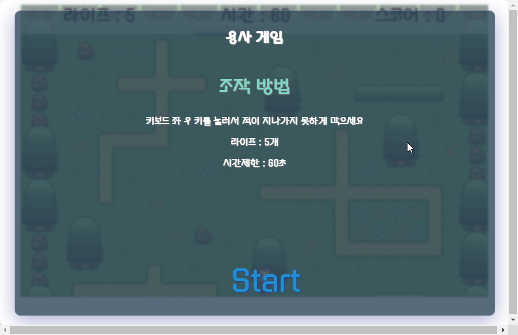
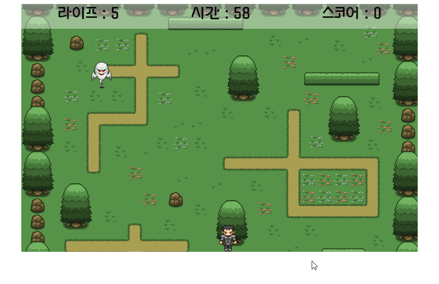
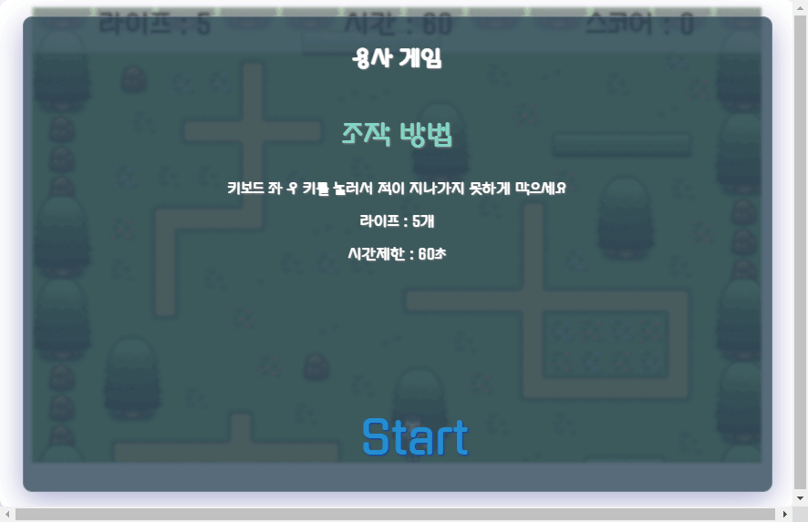

# Hero game

  https://zerosial.github.io/herogame/
   
   
  
  
   

## 프로젝트 소개

 HTML + CSS + JS 연습

    

 

## 기술 스택

|  Html   |  Css   | JavaScript |
| :-----: | :----: | :--------: |
| ![html] | ![css] |   ![js]    |

 

## 구현 기능

### 라이프와 시간에 따른 게임 오버

setinterval을 통한 60초 시간제한
시간이 지나면 게임 오버

### 유령을 죽이면 스코어 계산

유령과 용사가 충돌 발생시 스코어가 올라감

### 시작 화면 제작

모달 형식으로 start 화면 제작

 

## 배운 점 & 아쉬운 점

 CSS 적인 요소를 좀 더 교육했으면 좋았을 것 같다.

 

## 라이센스

<!-- Stack Icon Refernces -->

[js]: /images/stack/javascript.svg
[css]: /images/stack/css.svg
[html]: /images/stack/html.svg
